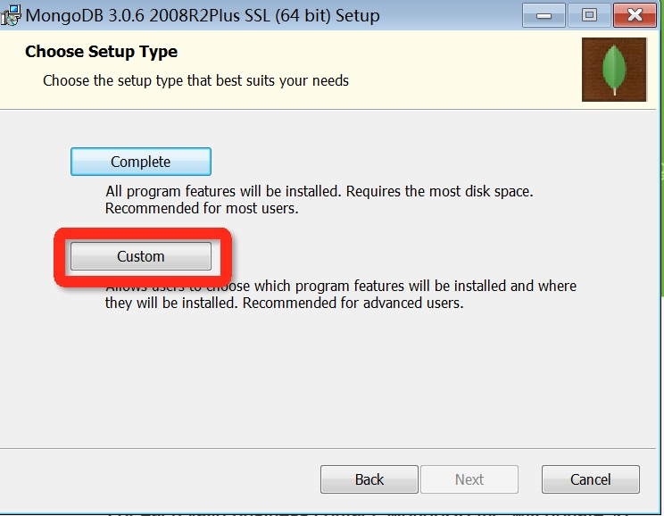

# MongoDB数据库安装及配置环境
1. 下载地址：https://www.mongodb.com/download-center#community

   安装过程中，你可以通过点击 "Custom(自定义)" 按钮来设置你的安装目录。

2. 创建数据目录
d:\data\db  //(数据目录应该放在根目录 C:\ 或者 D:\ 等)

3. MongDB的环境配置
+ 首先，我们先在bin目录下创建一个名为"mongod.config"的文件，在里面输入：

    database directory
    dbpath=d:\MongoDB\data

    log file
    logpath=d:\MongoDB\log
  然后保存该文件，请继续往下看。
+ 将MongoDB配置为服务
  我们将cmd命令行以管理员方式启动并将路径配置到 MongoDB/Server/3.4/bin目录下
  然后我们输入一行重要的命令(创建服务项)： `sc create mongodb binPath= "D:\Program Files\MongoDB\Server\4.0\bin\mongod.exe --service --dbpath d:\MongoDB\data --logpath=d:\MongoDB\log\mongodb.log --logappend --directoryperdb"`

4. 服务启动
+ 方法一："win+r" 进入“运行”界面，输入“services.msc”进入"服务" ；启动“MongoDB”的服务项
+ 方法二：在cmd中输入net start MongoDB，然后出现MongoDB 服务启动成功 字样说明我们启动该服务成功
5. 配置环境变量
鼠标右键选择“计算机”“属性” 选择“环境变量”，进入如下所示的界面
选择“新建”
我们在新建中输入自己安装的MongoDB的bin文件夹路径然后选择“确定”即可！
配置好环境变量后，我们可以在cmd中输入mongo就可以启动MongoDB数据库进行操作了
