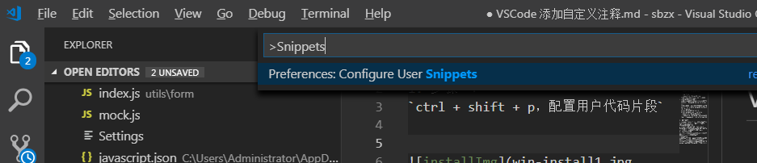
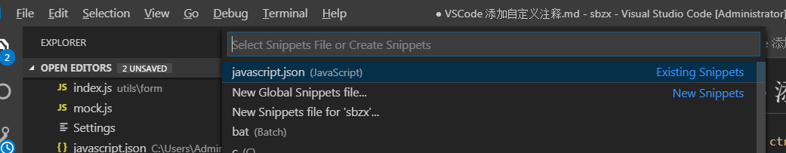

# VSCode 添加自定义注释
> 1. 步骤一：
```
ctrl + shift + p，配置用户代码片段
```

  


> 2. 步骤二：
``` 
点击javascript.json配置javascript`

```

> 3. 自定义自己喜欢的快捷键

```    "Print to js class": {
        "prefix": "zhushicc",
        "body": [
            "/*",
            " *@Description: $0",
            " *@ClassAuthor: Happy Ma",
            " *@Date: ${CURRENT_YEAR}-${CURRENT_MONTH}-${CURRENT_DATE} ${CURRENT_HOUR}:${CURRENT_MINUTE}:${CURRENT_SECOND}",
            "*/"
        ],
    },
    "Print to js method": {
        "prefix": "zhushimm",
        "body": [
            "/*",
            " *@Description: $0",
            " *@MethodAuthor:  Happy Ma",
            " *@Date: ${CURRENT_YEAR}-${CURRENT_MONTH}-${CURRENT_DATE} ${CURRENT_HOUR}:${CURRENT_MINUTE}:${CURRENT_SECOND}",
            "*/"
        ],
    },
```


    